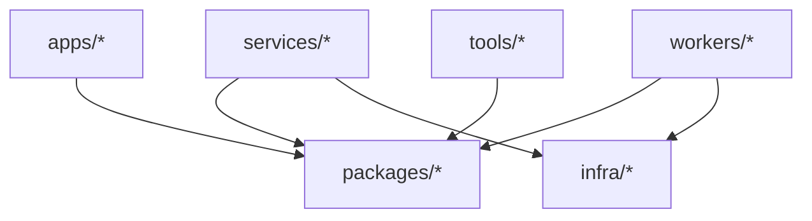

# Architecture

This scaffold is intentionally boring. It separates surfaces by logical ownership first. Language-specific folders are reserved for shared packages.

## Principles

- Stable logical folders make navigation cheap.
- Services, workers, and tools are product/domain/capability folders.
- Language names appear only under shared packages.
- Framework option folders appear only under app surfaces.
- Shared packages stay small and cross-cutting.
- Shared package lanes use `platform`, `serverkit`, and `testkit` concepts where applicable.
- Services and workers own their runtime concerns.
- Infrastructure starts local and can be promoted to deployment-specific modules.
- Agent instructions are versioned with the code.
- Review gates are part of the architecture, not an afterthought.

## Dependency Direction

Avoid dependencies from `packages/*` back into apps, services, workers, or tools.

## Implementation Quality

Architecture changes must preserve the engineering bar in `docs/engineering-standards.md`: root-cause fixes, small modules, explicit configuration, deterministic tests, and no hardcoded environment-specific values.
